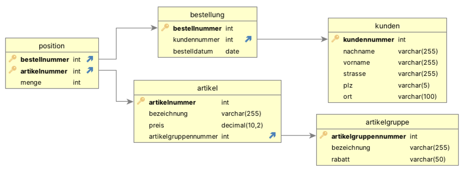

# 🛠 Coding Dojo – Backend zum OnlineShop-Frontend

## 🎯 Ziel
Ihr entwickelt ein **Spring Boot Backend**, das von einem bereits vorhandenen **Vue-Frontend** angesprochen wird. Das Frontend enthält Seiten für:
- die **Kundenübersicht**
- die **Artikelübersicht**
- die **Bestellübersicht**

Eure Aufgabe ist es, die zugehörigen **REST-Endpunkte im Backend** zu erstellen.
Als Datenbank dient der Onlineshop aus der Datenbanken-Lernstory:

---

## ✅ Mindestanforderung: Kundenübersicht
- Die Seite `/kunden` im Frontend soll Kundendaten anzeigen.
  - Endpunkt: `GET /kunden` → liefert alle Kunden als Liste
- Die Kundendaten sollen über den Bearbeiten-Button in der Kundenübersicht geändert werden können.
  - Endpunkt: `PUT /kunden/{kundennummer}` → aktualisiert den ausgewählten Kunden
---

## 🟡 für Schnelle: Artikel + Artikelgruppe

- Die Seite `/artikel` zeigt alle Artikel **mit zugehöriger Artikelgruppe**.
- Endpunkt: `GET /artikel` → Artikel inkl. Artikelgruppe
### Beispiel-JSON:
```json
[
  {
    "artikelnr": 1,
    "bezeichnung": "Tastatur",
    "preis": 29.99,
    "artikelgruppe": {
      "id": 1,
      "bezeichnung": "Zubehör"
    }
  }
]
```
---

## 🔵 für ganz Schnelle: Bestellungen & Positionen

- Die Seite /bestellungen zeigt alle Bestellungen mit zugehörigen Bestellpositionen.

### 🔧 Umsetzung
- Entitäten:
  - `Bestellung` (gehört zu einem Kunden)
  - `Position` (gehört zu einer Bestellung, enthält Menge + Artikel)
- Beziehungen:
  - `Kunde` **1:n** `Bestellung`
  - `Bestellung` **1:n** `Position`
  - `Position` **n:1** `Artikel`
- Endpunkt:
  - `GET /bestellungen` → JSON mit Bestellungen + Positionen

### Beispiel-JSON:
```json
[
  {
    "id": 1,
    "kunde": "Max Muster",
    "bestelldatum": "2024-05-02",
    "positionen": [
      { "artikel": "Tastatur", "menge": 2 },
      { "artikel": "Maus", "menge": 1 }
    ]
  }
]
```
